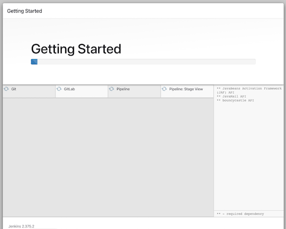
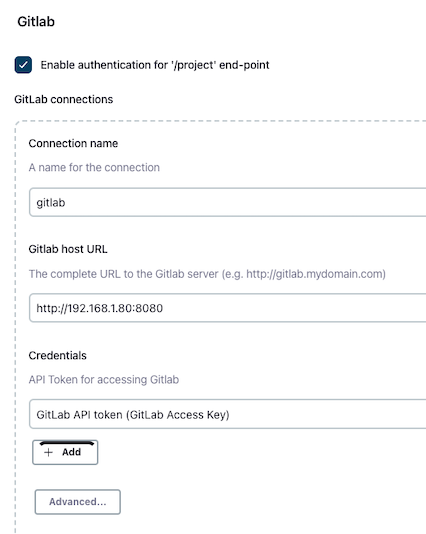
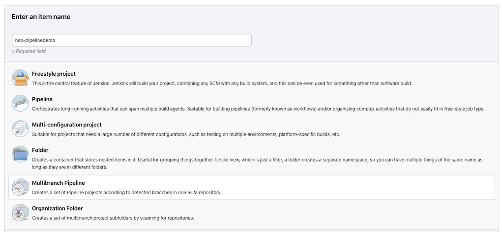

# 💻🤖🥫 NSO DevOps in a tin can 🥫🤖💻
A warm bowl of NSO CICD soup straight from a tin can (containerized), yet with a homemade taste. Ingredients are: GitLab-CE + NSO + Jenkins + 🧡 

## Environment setup
First of all, let's pour the contents of the tin can into a bowl. This repository has a setup file for spinning up all the containers that we need to get started. 
The system requirements consist on the following:

- Linux-based OS. This repository has been tested on CentOS and MacOS
- Docker engine
- Docker compose
- Python v3.9x

To get started, clone the repository in your host:
```
git clone https://github.com/ponchotitlan/NSO-DevOps-in-a-tin-can.git
```

Once copied, navigate to the repository source and run the following command:
```
sh setup.sh
```

The output shall be similar to the following one:
```

Warming up the contents of this tin can! 🥫🥫🥫

Setting up the Gitlab-CE container. This is our Control Versioning System (Setup will take some time) ... 🦊

Now, let's wait for Gitlab-CE web portal to be available ... 🦊

⏳⏳⏳⏳⏳⏳⏳⏳⏳⏳⏳⏳⏳⏳⏳⏳HTTP/1.1 302 Found
Success! You can login now to Gitlab-CE with the following information

    🦊 Address: localhost:8080
    👤 User: root
    🔑 Password: cisco123

You can change these credentials later on via the platform.
These credentials are available in the log file /gitlab-ce/gitlab_setup.log in this repository

Setting up the Jenkins container. This is our orchestrator (Setup will take some time as well) ... 💂

Likewise, let's wait for Jenkins web portal to be available ... 💂

⏳⏳⏳⏳⏳⏳⏳⏳⏳⏳⏳⏳⏳⏳⏳⏳HTTP/1.1 403 Forbidden
Success! You can login now to Jenkins with the following information

    💂 Address: localhost:4040
    🔑 Unlocking password: 24c86e86888b471bab7ed95049833811

Please perform the initial setup as shown in the README and the Wiki.
These credentials are available in the log file /jenkins/gitlab_setup.log in this repository

```

This will create a series of folders and spin-up the required containers for our CICD system:

- "/gitlab" folder in your ${HOME} directory
- "/jenkins" folder in your ${HOME} directory
- "gitlab-ce" Docker container
- "jenkins" Docker container

```

% docker ps
CONTAINER ID   IMAGE                    COMMAND                  CREATED          STATUS                    PORTS                                                 NAMES
3b82a46a94f9   jenkins/jenkins:lts      "/usr/bin/tini -- /u…"   21 minutes ago   Up 21 minutes             0.0.0.0:50000->50000/tcp, 0.0.0.0:4040->8080/tcp      jenkins
dc2f982239e8   yrzr/gitlab-ce-arm64v8   "/assets/wrapper"        48 minutes ago   Up 48 minutes (healthy)   22/tcp, 0.0.0.0:8080->80/tcp, 0.0.0.0:8443->443/tcp   gitlab-ce

```

The platform web interfaces will be available in the following locations:

- Gitlab-CE: localhost:8080
- Jenkins: localhost:4040

## Gitlab-CE and Jenkins setup
The soup is looking good ...
Now it's time to link Gitlab-CE and Jenkins for triggering our CICD pipelines whenever a new code version is pushed:

1. Login to the Jenkins portal located at localhost:4040 and unlock it using the password provided after the setup process



2. Install the Gitlab plugin. This will take some time ...


